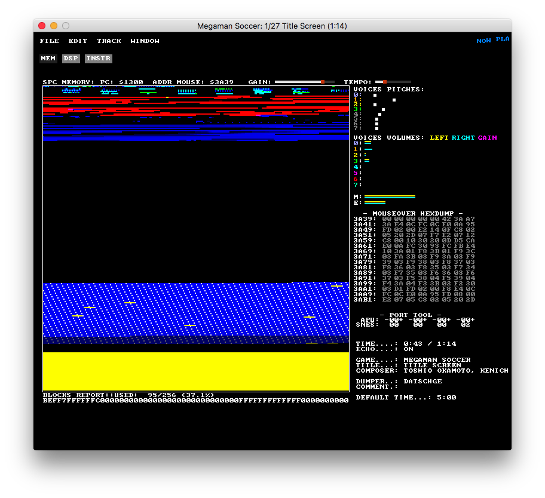

snestracker
===========

Congratulations, you have stumbled upon a rare item. Currently in its embryonic stages, snestracker aims to become a full-featured cross platform music production software for the Super Nintendo Entertainment System  (SNES), AKA the Super Famicom.

snestracker uses a custom SPC700 Audio Processing Unit (APU) emulator to produce cycle-accurate emulation, allowing you to create accurate SNES music in the comfort of your PC workstation.

snestracker will take advantage of the most important hardware Digital Signal Processing (DSP) features of the SNES, including noise, echo customization, pitch modulation, ADSR envelopes, stereo panning, and inverse phasing (surround sound).

The music that you create with SNES Tracker exports to various formats. It will export standalone music files in the form of a demo ROM, SPC, WAV. You will eventually be able to incorporate your new music and sound effects into your own custom programs / video games!

Here is an image of the current early prototype!

Building
--------
See [Building.md](./Building.md)

Road Map
--------
see [Roadmap.md](./Roadmap.md)

Debugger
========

In addition to the tracker, there is a debugger program that allows you to hone in on SPC files in various ways. Here is a preview of the main pane, based on raph's vspcplay.

Features
--------
- Memory Tab
  - Full view of RAM identifying read/write/execute points, including echo region and BRR sample/loop data regions.
  - Sample download
  - Real-time inspection and modification of SPC RAM and DSP registers
  - Global tempo and volume adjustments
  - Real-time channel activity indicators. pitch, volume, and gain.
  - Channel solo/mute
  - APU port interaction tool.
    - Interact with the SPC as if you are the SNES. This is great to find new sounds, or reverse engineer the SPC engine
- DSP Tab
  - Full access to all global and voice DSP registers in "break-out" format.
  - DIRectory tool - see what sample entries are active, download samples, change dir location!
- Instrument Tab
  - Play any voice at any octave, with ability to customize ADSR. Can even play through MIDI keyboard
- SPC Export

Community
=========

Feel free to join the new snestracker [Discord Server](https://discord.gg/ZckDaN). You may also join via IRC. **Server**: irc.esper.net **Channel**:#snestracker

The Discord and IRC are bridged by snesbot :)

Other Recommendations
=====================

Emulators
---------

- [mednafen](http://mednafen.fobby.net/ "Mednafen")
- [retroarch](http://www.libretro.com/)
- [zsnes](http://www.zsnes.com/) old but beloved
- [snes9x](http://www.snes9x.com/)
- for debugging, I prefer my fork of [bsnes-classic](https://github.com/bazzinotti/bsnes-classic).

Flash Carts
-----------
To play on the real Super Nintendo, you will need help of additional hardware, typically known as a flash cart:

- [SD2SNES](https://sd2snes.de)
- Super Everdrive
- [Tototek Superflash](http://www.tototek.com/store/index.php?main_page=product_info&cPath=1_8_11&products_id=39) (outdated)

Developed by Bazz, <bazz@bazz1.com>

Special thanks to Blargg.

Shoutout to byuu, Neviksti, mukunda (eKid), Oli (Vilxdryad) and the snesdev community!

