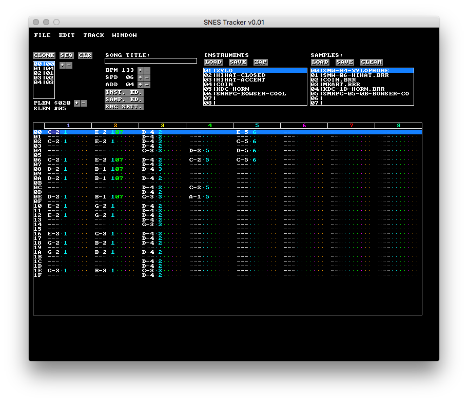

SNES Tracker
============

<!-- temporary external graphic until v0.1.1 is released to Github on August 18th 2020 -->

SNES Tracker aims to become a full-featured cross-platform music production software
for the Super Nintendo Entertainment System (SNES), aka the Super Famicom.

Visit [the SNES Tracker Youtube](https://youtube.snestracker.com) for an example of the music that you can make with the latest version.

SPC Debugger
------------

SNES Tracker also sports its own SPC debugger. See [Debugger.md](./Debugger.md) for
more details.

Road Map
--------
Coming soon, [Roadmap.md](./Roadmap.md)

Downloads
=========

Three flavours of pre-built SNES Tracker binaries are available for you!
- **OLD**: simply download from the [Releases Page](https://github.com/bazzinotti/snestracker/releases).
- **LATEST**: With any purchase from the [Gift Shop](https://shop.snestracker.com/) you'll receive a one-time instant download link to the latest version of SNES Tracker.
- **LATEST+INTERIM**: As a thank you to my [Patreon](https://patreon.snestracker.com/) Supporters, who help to keep this project going, the latest version of SNES Tracker is available exclusively via Patreon a few weeks before it becomes available on github. Support me and this project by becoming a Patreon Supporter and you will not only receive a download link to the latest stable version each time it is released - you'll also unlock access to the very latest interim builds, experience up-to-the-minute bug fixes, features and improvements weeks before anybody else. Aside from builds access, you can also earn privileged roles in our Discord community, receive generous shop discounts, exclusive behind the scenes updates, and more!

The following downloads are available:

- Windows 7 (64-bit) and newer
- MacOS 10.9 and newer
- Linux users are encouraged to build from source or run the Windows build under WINE until a Linux build is released.

For more information on building SNES Tracker yourself, see [Building.md](./Building.md)

How To
======

See the [Wiki](https://wiki.snestracker.com) to learn more about how to use and enjoy SNES Tracker from our ever-expanding knowledge base! If you get stuck, join our community (link below) to make helpful, friendly connections.

Community
=========

Feel free to join the new SNES Tracker [Discord Server](https://discord.snestracker.com). You may also join via IRC. **Server**: irc.esper.net **Channel**:#snestracker

The Discord and IRC are bridged by snesbot :)

Supporting
==========

I hope that you love what I'm doing with SNES Tracker. You see, SNES Tracker is still a
program that needs a lot of tender, loving care. If you would like to
get more involved, please take a look at my new
[Patreon](http://patreon.bazz1.com) and/or make a visit to the [Gift Shop](https://shop.snestracker.com)
 to find yourself something you'd appreciate having that also helps keep the project alive!

Contributing
============

Contributions from the community are valid and welcome! For those curious about
getting involved, have a look at [Good First Issues](https://github.com/bazzinotti/snestracker/issues?q=is%3Aissue+is%3Aopen+label%3A%22good+first+issue%22).
If you see an issue that appeals to you, post a comment demonstrating your
interest. You are also encouraged to join the Discord or IRC. Be interactive!
Together we will learn, grow, and make snestracker the best it can be.

By contributing, you acknowledge you have read and agreed to the [Fine Print](./Contributing.md)

Links
=====

[Youtube](https://youtube.snestracker.com) Subscribe and hit that notification bell for
exclusive SNES Tracker songs, insight and out-of-this-world SNES-related fun.

[Gift Shop](https://shop.snestracker.com) Browse for fun SNES Tracker products! Support the project,
in style, with branded goodies such as mugs and tshirts! Show the world your SNES obsession!

[Soundcloud](https://soundcloud.com/snestracker) Listen to official tunes and remixes.

[Wiki](https://wiki.snestracker.com) Learn more about how to use and enjoy SNES Tracker
from our ever-expanding knowledge base.

[Twitter](https://twitter.com/snestracker1) Be first to get instant news and musings on
upcoming features and new software releases.

Developed by Bazz, <bazz@bazz1.com>

Special thanks to Blargg & Raph.

Shoutout to byuu, Neviksti, mukunda (eKid), Oli (Vilxdryad), RowanDDR, and the snesdev community!
